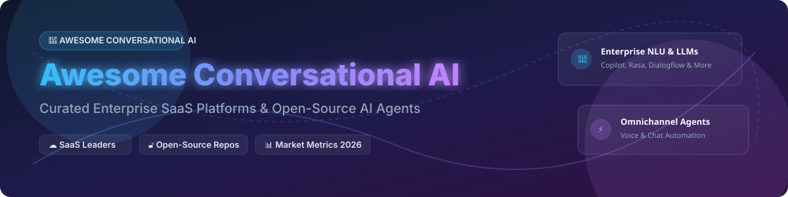

# 🚀 Awesome Conversational AI Platform 🤖

    

> **Curated directory of Enterprise Conversational AI SaaS Platforms, Voice AI Agents, Chatbot Frameworks, and Open-Source LLM Automation Tools.**

---

## 💡 Overview & Ecosystem Insights 🌟

This repository tracks notable **SaaS platforms** and **open-source projects** for **Conversational AI**, **Voice Assistants**, **Virtual Agents**, and **Omnichannel Support Automation**. These tools help enterprise architects, AI developers, and CX leaders build, deploy, and manage production-grade chatbots and LLM-powered virtual assistants across web, mobile, messaging apps, and cloud contact centers.

- **Market Category Leaders**: Microsoft Copilot Studio, Google Dialogflow, Amazon Lex, IBM watsonx Assistant, Rasa, Cognigy, Yellow.ai, Ada, Kore.ai, and Boost.ai.
- **Open-Source Ecosystem**: Production-proven and mature. **Rasa** leads enterprise NLU/dialogue management ($70.22M raised). **LangChain** is the standard for LLM orchestration (~137,900 stars). **Botpress** & **Typebot** offer visual flow builders, while **Flowise** & **Langflow** provide visual drag-and-drop LLM pipelines.

---

## 📖 Table of Contents 📑

- [☁️ SaaS/Hosted Platforms](#%EF%B8%8F-saashosted-platforms)
- [🔓 Open-Source GitHub Projects](#-open-source-github-projects)
- [🤝 How to Contribute](#-how-to-contribute)
- [❤️ Support & Sponsorship](#%EF%B8%8F-support--sponsorship)
- [⭐ Star History](#-star-history)
- [⚠️ Disclaimer](#%EF%B8%8F-disclaimer)

---

## ☁️ SaaS/Hosted Platforms 🌐

> **📊 Market Size & Structure**: The global conversational AI market size is estimated at **~$14.79B in 2025**, projected to reach **~$82.46B by 2034** at a **~21% CAGR**. The market is **moderately fragmented**, led by cloud hyperscalers (Microsoft, Google, AWS, IBM) alongside specialized enterprise AI platforms (Cognigy, Kore.ai, Yellow.ai). 

*Sorted by Company Size / Valuation / Revenue (descending).*

| Platform 🏢 | Description 📝 | Pricing (Starting Tier) 💵 | Free Tier Limits 🎁 | Company Size (Revenue / Valuation) 📈 |
| :--- | :--- | :--- | :--- | :--- |
| **[Amazon Lex](https://aws.amazon.com/lex/)** | AWS conversational AI using deep learning NLU. Intent recognition, slot filling, and multi-turn voice/chat dialogue. | **V2**: **$0.00075 per text request**; **$0.004 per audio request** | **AWS Free Tier**: **10,000 text requests/month** + **5,000 speech requests/month** for 12 months | **~$638B revenue (Amazon FY2025)** |
| **[Google Dialogflow](https://cloud.google.com/dialogflow)** | Google's enterprise conversational AI platform with NLU and flow-based design (**Dialogflow CX**). | **Dialogflow ES**: **$0.002 per text query**. **Dialogflow CX**: **$0.007 per text query** | **Dialogflow ES**: **1,000 text queries/day** free. **Dialogflow CX**: **$600 GCP credits** for 90 days | **~$350B revenue (Alphabet FY2025)** |
| **[Microsoft Copilot Studio](https://www.microsoft.com/en-us/microsoft-copilot/microsoft-copilot-studio)** | Microsoft's enterprise agent platform integrated with Microsoft 365, Teams, and Dynamics 365. | **$200/month** for 25,000 messages (tenant pack) | **Free trial**: **30-day trial** with full platform access | **$331.8B revenue (FY2026), ~$3.8T market cap** |
| **[IBM watsonx Assistant](https://www.ibm.com/products/watsonx-assistant)** | Enterprise AI assistant platform with NLU, customer care flows, and multi-cloud deployment. | **Lite**: Free; **Plus**: **$140/month** (includes 1,000 MAU) | **Lite plan**: Free forever with **1,000 unique monthly active users** | **~$63B revenue (IBM FY2025)** |
| **[Kore.ai](https://kore.ai/)** | Enterprise conversational AI & generative AI platform for virtual assistants and contact center automation. | **Pay-as-you-go**: Minimum reload from **$100** | **Free plan**: **5,000 free sessions** per account (up to 5 bots) | **~$1B valuation** (~$150M+ raised) |
| **[Yellow.ai](https://yellow.ai/)** | Omnichannel conversational AI for customer support and employee automation. | **Premium**: Custom enterprise quote (sales-led) | **Freemium plan**: **5,000 monthly bot conversations** + 500 tickets/month | **~$1B valuation** (~$102M raised) |
| **[Cognigy](https://www.cognigy.com/)** | Enterprise contact center AI automation platform for voice and chat agents. | **Starting at ~$2,500/month** (Enterprise contracts up to **$300,000+/year**) | **Free trial / Pilot**: **Custom enterprise proof-of-concept** upon request | **~$100M+ raised (Est. $500M+ valuation)** |
| **[Ada](https://www.ada.cx/)** | Automated enterprise customer service platform powered by generative AI. | **AWS Marketplace**: **$33,000/year** for 60,000 conversations | **No free tier** (Requires scheduled enterprise sales demo) | **~$200M+ raised (Est. $1B+ valuation)** |
| **[Boost.ai](https://boost.ai/)** | Enterprise conversational AI platform tailored for banking, insurance, and public sector. | **Starting at $50,000/year** | **No free tier** (Requires enterprise demo) | **Private (~$50M+ raised)** |

---

## 🔓 Open-Source GitHub Projects ⚡

*Sorted by GitHub Stars_Count (descending). Badges link directly to stargazers.*

| Repo 📦 | Description 📝 | GitHub_Stars ⭐ |
| :--- | :--- | :--- |
| **[Transformers (Hugging Face)](https://github.com/huggingface/transformers)** | State-of-the-art Machine Learning & NLU models for PyTorch, TensorFlow, and JAX. |  |
| **[LangChain](https://github.com/langchain-ai/langchain)** | Building applications with LLMs through composability, memory, retrieval, and agents. |  |
| **[Langflow](https://github.com/langflow-ai/langflow)** | Dynamic graph-based UI for building multi-agent AI applications and vector pipelines. |  |
| **[Flowise](https://github.com/FlowiseAI/Flowise)** | Drag & drop UI to build customized LLM flows and AI agent workflows. |  |
| **[Rasa](https://github.com/RasaHQ/rasa)** | Open-source conversational AI framework for building contextual chatbots and assistants. |  |
| **[Chatwoot](https://github.com/chatwoot/chatwoot)** | Open-source customer engagement platform and AI support helpdesk alternative to Intercom. |  |
| **[Typebot](https://github.com/baptisteArno/typebot.io)** | Open-source conversational form builder & lead generation chatbot platform. |  |
| **[Botpress](https://github.com/botpress/botpress)** | Open-source developer platform for building modular chatbot automation and agents. |  |
| **[AstrBot](https://github.com/AstrBotDevs/AstrBot)** | All-in-one multi-platform AI Agent chatbot framework supporting 1000+ plugins. |  |
| **[Chainlit](https://github.com/Chainlit/chainlit)** | Build production-ready Conversational AI Python apps in minutes with streaming UI. |  |
| **[BotMan](https://github.com/botman/botman)** | PHP framework for chatbot development across Slack, Telegram, Messenger, and Alexa. |  |

---

## 🤝 How to Contribute 🛠️

Contributions are welcome! Please follow these simple guidelines:

1. Fork this repository.
2. Edit `README.md` to add or update entry details (keep description factual, include pricing/star details).
3. Submit a Pull Request with a short summary of changes.

---

## ❤️ Support & Sponsorship 🙏

If you find this curated list valuable for your research, team, or project:

- 🌟 **Star the repository** to show support and help others discover it.
- 🔀 **Fork it** to maintain your custom notes or lists.
- 📣 **Share it** with colleagues, AI developers, and CX architects!
- ☕ **Buy me a coffee / Sponsor**: If you'd like to support ongoing maintenance and research, consider sponsoring via the [GitHub Sponsor Dashboard](https://github.com/sponsors/ishandutta2007).

---

## ⭐ Star History

---

## ⚠️ Disclaimer 📜

- This repository is a **community-curated index** and is not affiliated with or endorsed by any listed vendors.
- Conversational AI software processes user conversations and personal data; ensure strict compliance with GDPR, CCPA, and enterprise privacy policies.
- **Pricing & Tier Disclaimer**: Pricing models change frequently. Please verify current pricing directly with vendors before procurement.

---

**Made for Conversational AI Engineers, CX Leaders, and Enterprise Architects.**
